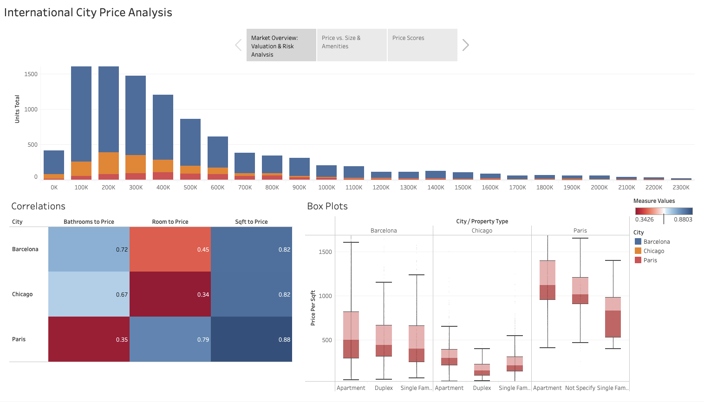
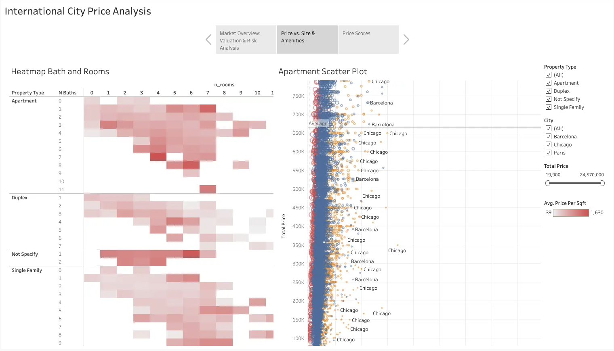
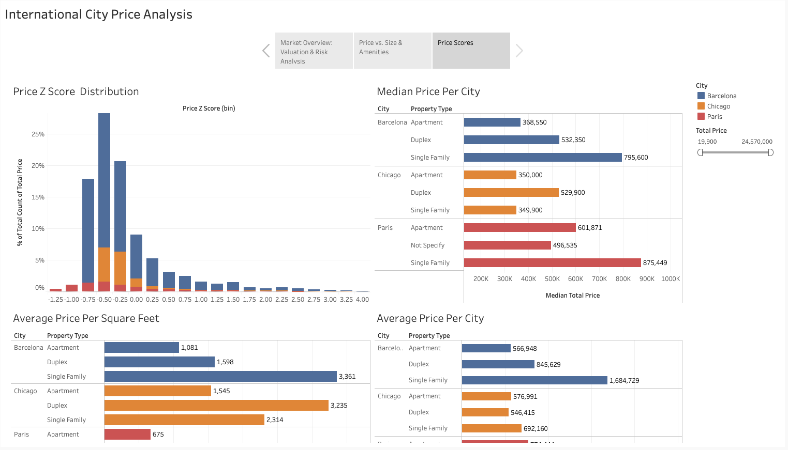

# Houses Analysis 2024

Real estate data analysis project comparing residential property listings across **Chicago, Paris, and Barcelona**. The project uses SQL to standardize city-specific datasets, create reusable analysis views, and prepare the data for interactive Tableau dashboards.

## Tableau Public Story

Complete Tableau analysis:

https://public.tableau.com/app/profile/humberto.bohorquez/viz/2024_price_city_analysis/Story1

The Tableau story contains three visualization dashboards:

1. **Market Price Relationships**
   - Price distribution by city.
   - Correlation between city, number of bathrooms, and price.
   - Relationship between number of rooms and price.
   - Square footage to price heatmap.
   - Box plot comparing property type in each city by price per square foot.

2. **Property Features and Apartment Pricing**
   - Heatmap comparing property type with number of bathrooms and rooms.
   - Apartment scatter plot relating price per square foot to total price.

3. **City-Level Price Benchmarks**
   - Price z-score distribution.
   - Median price per city.
   - Average price per square foot.
   - Average price per city.

## Dashboard Preview

Add screenshots from the Tableau story here to make the README easier to scan and more visually aligned with a data analysis portfolio.





## Project Overview

This project analyzes international residential property markets by combining separate city datasets into a unified structure. The goal is to compare prices, property characteristics, and price efficiency across cities using consistent metrics such as total price, square footage, rooms, bathrooms, and price per square foot.

The analysis focuses on questions such as:

- How do real estate prices vary across Chicago, Paris, and Barcelona?
- How do square footage, rooms, and bathrooms relate to total property price?
- Which property types show higher or lower price per square foot?
- How do average and median prices differ by city?
- Which properties appear unusually expensive or inexpensive compared with their city average?

## Repository Structure

```text
Houses_Analysis_2024/
├── Data/
│   ├── real_estate_barcelona.csv
│   ├── real_estate_chicago.csv
│   └── real_estate_paris.csv
├── images/
│   ├── Dashboard-1.png
│   ├── Dashboard-1.png
│   ├── Dashboard-3.png
│   └── .gitkeep
├── queries/
│   ├── DataSorting.sql
│   ├── HousesAnalysis.sql
│   └── Unifytables.sql
└── README.md
```

## Data Sources

The project uses three city-level CSV datasets:

- `Data/real_estate_chicago.csv`
- `Data/real_estate_paris.csv`
- `Data/real_estate_barcelona.csv`

Each dataset contains property-level information, including fields such as property type, room count, bathroom count, living area, construction year, listing price, and related listing attributes. Because the raw files use different column names and formats, SQL transformations are used to create a comparable analysis table.

## Data Quality Summary

The table below summarizes the raw city datasets before the cleaned SQL analysis views are created. Missing or invalid area values refer to the field used as the property-size input for each city: `sqft` for Chicago, `Living` for Paris, and `sq_m_built` for Barcelona.

| City | Raw Rows | Missing Price Values | Missing or Invalid Area Values | Rows With Valid Price and Area | Valid Share |
| --- | ---: | ---: | ---: | ---: | ---: |
| Chicago | 2,000 | 6 | 553 | 1,444 | 72.20% |
| Paris | 896 | 0 | 1 | 895 | 99.89% |
| Barcelona | 10,106 | 0 | 0 | 10,106 | 100.00% |

After filtering for valid positive price and square-foot values in the cleaned SQL view, the analysis dataset contains:

| City | Cleaned Property Count | Average Price | Median Price | Average Price per Sq Ft |
| --- | ---: | ---: | ---: | ---: |
| Chicago | 1,443 | $647,490.16 | $350,000.00 | $259.86 |
| Paris | 895 | $762,832.96 | $588,739.00 | $1,119.85 |
| Barcelona | 10,106 | $620,639.18 | $391,950.00 | $468.07 |

## Data Dictionary

### Raw Datasets

**Chicago: `Data/real_estate_chicago.csv`**

| Column | Description |
| --- | --- |
| `type` | Original property category, such as single family, apartment, condo, townhome, or multi-family. |
| `text` | Listing description text. |
| `year_built` | Year the property was built. |
| `beds` | Number of bedrooms. |
| `baths` | Total number of bathrooms. |
| `baths_full` | Number of full bathrooms. |
| `baths_half` | Number of half bathrooms. |
| `garage` | Garage availability or garage count. |
| `lot_sqft` | Lot size in square feet. |
| `sqft` | Interior property size in square feet. |
| `stories` | Number of property stories or floors. |
| `lastSoldPrice` | Previous sale price, when available. |
| `soldOn` | Previous sale date, when available. |
| `listPrice` | Current listing price. |
| `status` | Listing status, such as `for_sale`. |

**Paris: `Data/real_estate_paris.csv`**

| Column | Description |
| --- | --- |
| `PropertyTitle` | Property listing title. |
| `Price` | Current listing price. |
| `Rooms` | Total number of rooms. |
| `Floors` | Number of floors or floor-related listing value. |
| `Bedrooms` | Number of bedrooms. |
| `Living` | Living area, originally stored in square meters. |
| `Type` | Original property category. |
| `Condition` | Property condition. |
| `Standing` | Property quality, class, or standing indicator. |
| `ConstructionYear` | Year the property was built. |
| `Total` | Total area or listing total field from the source dataset. |
| `Bathrooms` | Number of bathrooms. |
| `Land` | Land area or land-related listing value. |
| `ParkingLots(Outside)` | Number of outside parking spaces. |
| `ParkingLots(Inside)` | Number of inside parking spaces. |
| `Internal` | Internal feature indicator from the source dataset. |
| `Terraces` | Terrace availability or terrace count. |
| `Garages(Outside)` | Number of outside garages. |
| `Cellar` | Cellar availability or cellar count. |
| `Beds` | Bed count field from the source dataset. |

**Barcelona: `Data/real_estate_barcelona.csv`**

| Column | Description |
| --- | --- |
| `id` | Unique record identifier. |
| `property_type` | Original property category. |
| `city` | City value from the source dataset. |
| `price` | Current listing price. |
| `sq_m_built` | Built property area in square meters. |
| `n_bedrooms` | Number of bedrooms. |
| `bathrooms` | Number of bathrooms. |
| `floor` | Floor level. |
| `year_built` | Year the property was built. |
| `exterior` | Indicator for whether the property is exterior-facing. |
| `parking` | Parking availability or parking field from the source dataset. |
| `log_price` | Log-transformed price value from the source dataset. |
| `city-neighborhood` | Neighborhood or city-neighborhood label. |

### Cleaned Analysis Fields

These fields are created in the SQL workflow to make the three city datasets comparable in Tableau.

| Field | Description |
| --- | --- |
| `city` | Standardized city name: Chicago, Paris, or Barcelona. |
| `property_type` | Normalized property category, such as `apartment`, `duplex`, or `single_family`. |
| `n_rooms` | Standardized room or bedroom count used for cross-city comparison. |
| `n_baths` | Standardized bathroom count. |
| `sqft_size` | Property size in square feet. Paris and Barcelona square-meter values are converted to square feet. |
| `year_built` | Standardized construction year. |
| `total_price` | Standardized listing price used for analysis. |
| `price_per_sqft` | Total price divided by square footage. |
| `age` | Approximate property age, calculated as current year minus `year_built`. |
| `bed_bath_ratio` | Ratio of rooms to bathrooms. |
| `price_z_score` | City-level z-score showing how far a property price is from its city average. |
| `property_count` | Number of valid properties in each city-level summary. |
| `avg_price` | Average listing price by city. |
| `median_price` | Median listing price by city. |
| `avg_price_per_sqft` | Average price per square foot by city. |
| `stddev_price` | Standard deviation of listing prices by city. |
| `total_records` | Total records by city in the data quality view. |
| `missing_price` | Count of records missing price values. |
| `invalid_sqft` | Count of records with missing or invalid square-foot values. |
| `pct_valid` | Percentage of records with valid price and square-foot values. |

## SQL Workflow

The SQL files in `queries/` support the data preparation and analysis process:

- `Unifytables.sql` standardizes the Chicago, Paris, and Barcelona datasets into one city-level view with consistent fields.
- `HousesAnalysis.sql` creates analytical views for cleaned properties, price per square foot, property age, bed-to-bath ratio, city statistics, z-scores, and data quality checks.
- `DataSorting.sql` contains exploratory SQL used to inspect and validate property data during the analysis process.

The unified analysis structure includes:

- `city`
- `property_type`
- `n_rooms`
- `n_baths`
- `sqft_size`
- `year_built`
- `total_price`
- `price_per_sqft`
- `price_z_score`

## Tools Used

- **SQL:** data cleaning, transformation, table unification, and analytical views
- **MySQL / SQLite:** database querying and analysis workflow
- **Tableau Public:** interactive dashboards and visual storytelling
- **CSV datasets:** raw city-level property listing data

## Analytical Approach

The project follows a data analysis workflow:

1. Import city-specific real estate CSV files.
2. Clean and standardize inconsistent column names, property types, units, and price formats.
3. Convert living area values into square feet where needed.
4. Normalize property categories such as apartments, duplexes, and single-family homes.
5. Create a unified city table for cross-market comparison.
6. Calculate derived metrics such as price per square foot, property age, and price z-score.
7. Build Tableau dashboards to compare price distribution, property features, and city-level benchmarks.

## Methodology Notes

- **Area conversion:** Paris and Barcelona area values are converted from square meters to square feet using `1 square meter = 10.7639 square feet`. Chicago area values are already stored in square feet.
- **Currency conversion:** Paris prices are treated as already standardized to USD in the SQL workflow. Barcelona prices are converted by multiplying the source price by `1.17`, based on the conversion assumption used in `queries/Unifytables.sql`.
- **Property type normalization:** Source property labels are grouped into common categories such as `apartment`, `duplex`, and `single_family` so the cities can be compared more consistently.
- **Valid analysis records:** The cleaned analysis views keep records with positive `total_price` and positive `sqft_size`, which helps prevent invalid price-per-square-foot calculations.

## Findings

- **Paris has the highest price efficiency metric:** Paris shows the highest average price per square foot at `$1,119.85`, well above Barcelona at `$468.07` and Chicago at `$259.86`.
- **Median prices are lower than average prices in every city:** This suggests each market contains high-price listings that pull the average upward, making median price useful for a more typical market benchmark.
- **Barcelona provides the largest analysis sample:** Barcelona contributes `10,106` valid records, giving it the broadest dataset for dashboard-level comparisons.
- **Chicago has the largest raw data completeness issue:** Chicago has `553` missing or invalid area values, which reduces the usable analysis sample from `2,000` raw rows to `1,443` cleaned records.
- **The Tableau dashboards support both property-level and city-level comparison:** The dashboard views connect individual property features, such as rooms, bathrooms, square footage, and property type, with broader city benchmarks such as median price, average price, and price z-score distribution.

## Key Outputs

- A unified real estate dataset for Chicago, Paris, and Barcelona.
- SQL views for cleaned property records, z-score analysis, city statistics, and data quality.
- Tableau dashboards showing price distribution, feature-to-price relationships, property type comparisons, and city-level market benchmarks.


